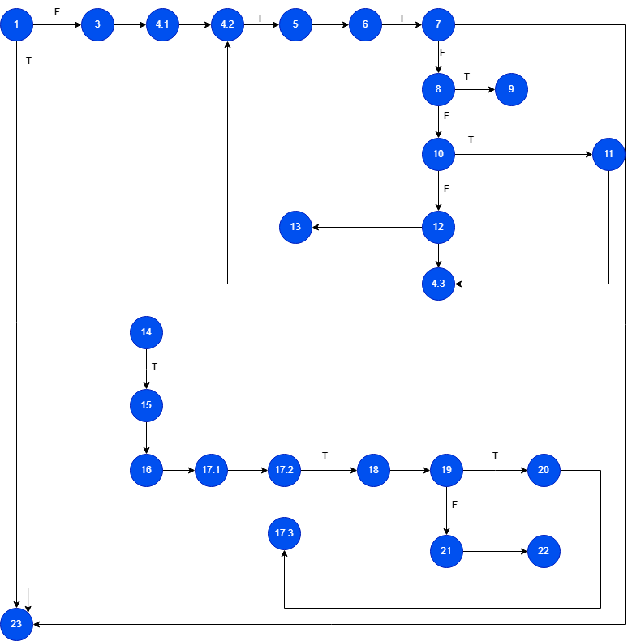

# SI_2025_lab2_192092
## Назар Зејнеловски, бр. на индекс 192092
### Група на код:
---

### Control Flow Graph
Фотографија од control flow graph-ot

### Цикломатска комплексност
Циколматска комплексност за функцијата checkCart е 9. Комплексността ја пресметав со формулата V(G)=D+1, користејќи го нацртаниот граф.

### Тест случаи според критериумот Every statement
....

### Тест случаи според критериумот Every path
....

### Објаснување на напишаните unit tests
... ...
